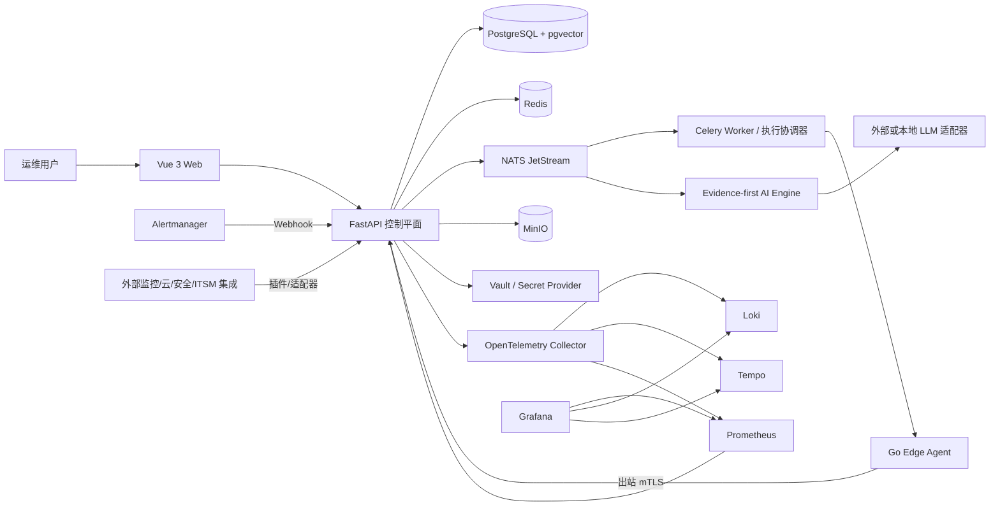
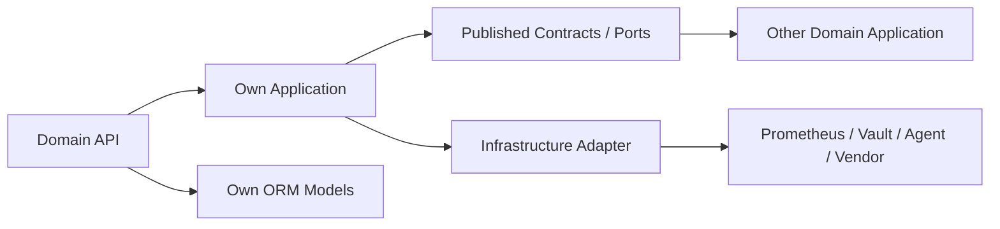

# 系统架构

## 总览

当前默认 Compose 已声明 Web、API、Worker、AI Engine、PostgreSQL/pgvector、Redis、NATS、
MinIO、Vault、Agent Gateway、node_exporter、Prometheus、Alertmanager、OpenTelemetry
Collector、Loki、Tempo 和 Grafana。声明服务不等于当前运行态已启用：最新测试环境事实和
文件/运行态边界以 `docs/STATUS.md` 为准。

## 模块化单体

控制平面按领域拆分。每个模块拥有自己的 `infrastructure/models.py`，并通过
`application.py` 或 `contracts.py` 发布跨域读写能力；API Router 只允许直接使用本域模型。
`tests/architecture/test_domain_boundaries.py` 使用 AST 检查并禁止任何模块 import 其他领域
的 ORM Model。跨模块状态变更在同一事务中调用拥有者发布接口，异步集成通过版本化事件。

当前已落地基础模块：

- `system`：健康、就绪、版本和运行状态。
- `tenant`：租户、项目持久化模型。
- `identity`：用户、角色、分配关系模型。
- `cmdb`：资产和资产关系模型。
- `audit`：追加式审计模型和数据库保护触发器。
- `agent_control`：一次性注册、可恢复的短期 mTLS 证书轮换、心跳和签名任务。
- `operations`：Prometheus、Alert、Event、维护窗口和证据时间线。
- `monitoring`：监控目标、资产唯一绑定、MetricsBackend 端口和 Prometheus Adapter。
- `discovery`：受控私网 TCP 发现任务、运行记录、候选资产、观测证据和人工确认。
- `automation`：Runbook 版本、策略、任务和审批。
- `ai_gateway`：Evidence-first AI 状态与结构化分析。
- `integrations`：外部适配器注册、版本、凭据引用和健康探测。

### 依赖方向

- `api.py` 不得 import 其他领域的 `infrastructure.models`。
- 发布的 View/Scope 使用 dataclass 或字典快照，不向调用方泄露可变 ORM 实体。
- 资产状态只能经 CMDB application 更新；监控数据经 `MetricsBackend` Protocol 获取。
- AI 事件上下文由 Operations application 组装；AI Gateway 不直接读取告警/事件表。
- Agent 任务与 Automation 状态通过双方 contract 协作；Operations 拥有事件时间线写入。
- 数据库迁移和应用启动装配是允许导入全部模型的基础设施入口，不属于业务模块跨域访问。

## 事件驱动

所有事件使用 `packages/contracts/events/v1/event-envelope.schema.json`。API 在业务审计事务内写 `event_outbox`，Celery Beat 每 5 秒触发 Worker 批量锁定待发布记录，以 `Nats-Msg-Id=event_id` 发布到 `AIOPS_EVENTS_V1` JetStream 并记录终态/退避重试。消费方使用 `event_id` 幂等处理。禁止在数据库事务提交前宣称事件已发布。

## 数据归属

- PostgreSQL：业务状态、关系、索引、摘要、证据引用。
- Prometheus/Loki/Tempo：指标、日志和链路原始数据。
- MinIO：报告、附件、原始归档与扫描报告。
- Redis：短期缓存、限流、锁、Celery broker；不作为业务事实源。
- Vault：凭据值；数据库只保存 `credential_ref`。

## 部署单元

Web、API、Worker、AI Engine、Edge Agent 都可独立扩缩容。第一阶段仍保持一个控制平面代码库和数据库，以避免形式化微服务带来的分布式复杂度。
