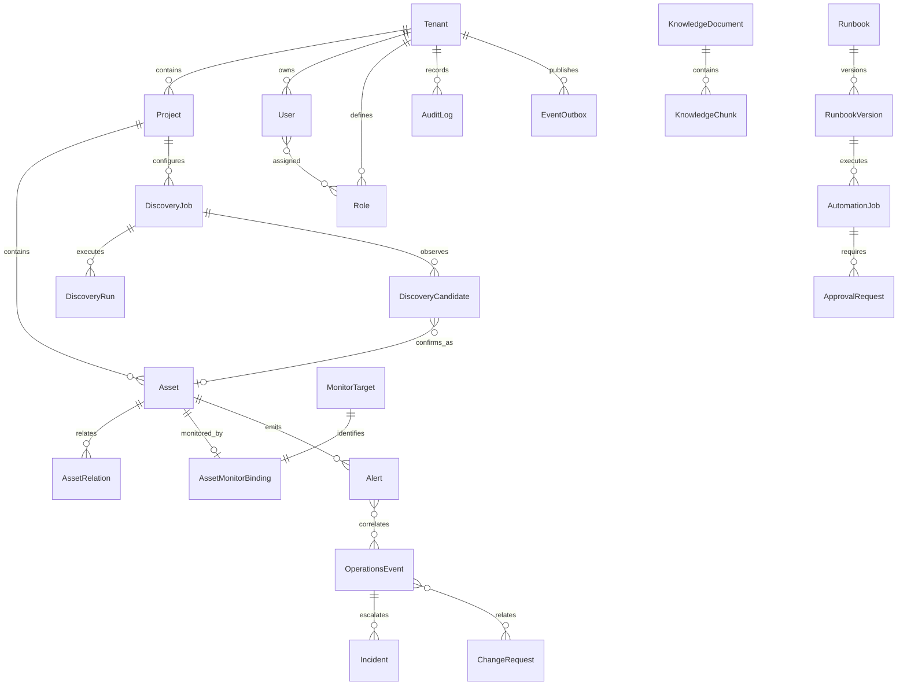

# 数据模型

当前工作区模型对应 Alembic `0016_discovery_control_plane`；该迁移尚未部署到测试环境。测试
环境仍停在 `0014_security_center`，详见 `docs/STATUS.md`。

## 当前实体

- Tenant/Project：`Tenant`、`Project`。
- Identity：`User`、`Role`、`UserRole`、`AuthSession`、`Department`、
  `UserDepartment`、`IdentityGroup`、`GroupMembership`、`ProjectMembership`、
  `ApiToken`、`OidcAuthorizationState`、`OidcIdentity`。
- CMDB：`Asset`、`AssetRelation`。
- Monitoring：`MonitorTarget`、`AssetMonitorBinding`。绑定保存 Prometheus job/instance、
  tenant/project 标签快照和资产身份标签；数据库及 API 共同阻止同一项目中的重复目标和
  同一资产用途的重复绑定。
- Discovery：`DiscoveryJob`、`DiscoveryRun`、`DiscoveryCandidate`。任务只接受有界 RFC1918
  IPv4 网段；运行记录真实状态和计数；候选保存版本化观测证据、稳定指纹、人工审查状态及
  可选 Asset 外键。
- Agent：`AgentRegistrationToken`、`EdgeAgent`、`AgentTask`。
- Operations：`Alert`、`OperationsEvent`、`EventAlert`、`EventTimelineEntry`、
  `MaintenanceWindow`。
- Automation：`Runbook`、`RunbookVersion`、`AutomationJob`、`ApprovalRequest`、
  `ApprovalDecision`。
- Evidence/Incident/Change：`EvidenceRecord`、`Incident`、`IncidentTimelineEntry`、
  `IncidentPostmortem`、`ChangeRequest`、`ChangeApprovalDecision`、`ChangeTimelineEntry`。
- Integrations/Plugins：`Integration`、`PluginDefinition`、`PluginInvocation`。
- Knowledge/Reliability/Reporting：`KnowledgeDocument`、`KnowledgeChunk`、
  `ServiceLevelObjective`、`SloEvaluation`、`CapacityAnalysis`、`GeneratedReport`。
- Security：`SecurityFinding`、`VulnerabilityRecord`、`RemediationRecord`、`RiskRecord`、
  `SecurityTicket`。
- Audit/Events：`AuditLog`、`EventOutbox`。

实体存在只表示 schema/代码已实现，不代表上游真实发现、采集、厂商适配或产品工作流已经
完成。当前发现任务与候选链已存在；设备/接口/服务/容器/Kubernetes/数据库监控实体，以及
规则版本和发布实体仍待后续阶段设计和迁移。

## 发现候选与 CMDB 约束

1. 单任务最多 256 台主机和 16 个端口，生产后端只做私网 TCP connect，不接收或保存凭据。
2. 每次成功观测写入 `discovery.observation.v1` 证据；重复发现按租户/项目/IP 稳定指纹校准。
3. 未再次观测到的未确认候选变为 `stale`；已确认资产不会被扫描结果自动退役。
4. 候选默认不能被监控或自动化当成正式资产。只有管理员确认后才能关联同项目同 IP 的现有
   Asset，或创建监控状态为 `not_configured` 的新 Asset。
5. 发现成功不代表监控成功；仍需后续建立并实时验证唯一 MonitorTarget/Binding。

## 监控绑定与数据正确性约束

1. API 先按租户、项目和资产权限创建唯一 `MonitorTarget`/`AssetMonitorBinding`。
2. 验证时用完整 job、instance、tenant、project、asset 标签执行 Prometheus 即时查询。
3. 只有恰好一个目标、身份标签完全一致且样本时间不超过配置上限时才标记 verified。
4. 指标读取和 Alertmanager 接入均重新实时校验；数据库中的历史 verified 状态不能替代
   当前 Prometheus 证据。
5. 无绑定、重复、过期或错标签时 fail closed；Web 清除旧指标，不显示其他资产缓存。

## 通用约束与已知债务

- 主键使用 UUID，业务外部 ID 单独建列；时间使用 timezone-aware UTC timestamp。
- 租户数据必须可经 `tenant_id` 或受控父实体验证；所有新唯一约束需评估租户/项目范围。
- 原始指标、日志和链路保存在专用后端，PostgreSQL 只保存业务状态、摘要和证据引用。
- PostgreSQL 只保存 `credential_ref`；Secret 值由配置的 Secret Provider 管理。
- Incident/Change 等部分跨域关联仍使用 JSON/UUID 而非完整 FK，属于审计报告指出的数据
  完整性债务，后续迁移前不得宣称已解决。

## Development seed

`make seed-dev` 只登记开发资产地址、端口、用户名、历史连接摘要和 Vault
`credential_ref`，并将当前连接状态设为 `not_checked`；不接受或持久化明文密码，也不会
自动创建“已验证”的监控绑定。
