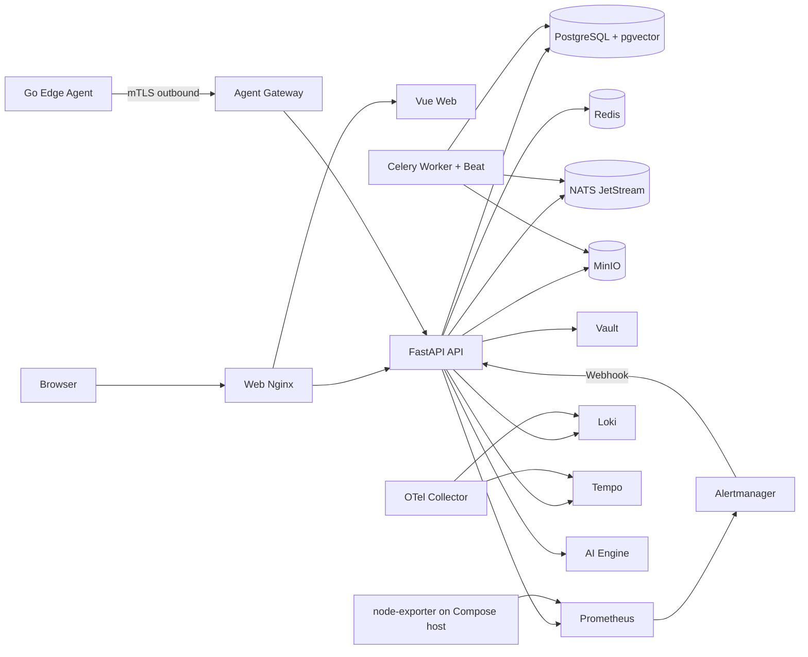
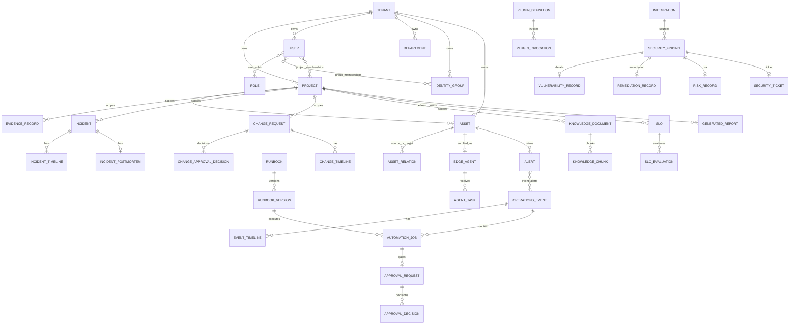

# 当前智能监控运维平台项目体检报告

> 审计日期：2026-08-13（Asia/Shanghai）
> 审计对象：AIOps-X Enterprise 当前工作区与测试环境当前发布
> 审计方式：全仓库静态审查 + 测试环境只读运行态核对
> 本轮边界：未修改业务代码、迁移、部署配置或测试；未执行正式测试、部署、重启或数据写入

# NOT READY FOR TESTING

当前测试准入总分为 **51/100**，低于 80 分；Architecture、Frontend、Backend、API、Database、Monitoring、Alerting、Data Integrity 均未达到强制最低分。平台当前是一个已经具备较完整企业控制面骨架、安全基础和若干真实基础设施连接的 **AIOps 平台原型/半成品**，但还不是具备正式测试资格的企业级智能监控运维产品。

容器启动、页面可打开、API 返回 200、数据库迁移到 head，不能证明“真实设备 → 真实采集 → 资产身份绑定 → 指标 → 规则 → 告警 → 事件 → 处置 → 恢复 → 审计”的业务链成立。当前最关键的缺口是：真实资产数据链未闭合、核心监控产品未实现、告警规则与生命周期不完整、设备厂商/模型厂商仅有通用框架、前端存在大量运维孤岛、既有验收脚本可产生业务链已经通过的假阳性判断。

---

## 1. 当前项目总体状态

### 1.1 已证实的当前基线

- 工作区包含 360 个非 AppleDouble 文件，主要由 API、Web、Worker、AI Engine、Edge Agent、14 个数据库迁移、Compose/Helm、监控与可观测性配置、测试和运维脚本组成。
- 当前 FastAPI 部署对外公开 **127 个 OpenAPI operation**。
- Web 有 **30 个路由/30 个 View**，但页面数量明显高于真实监控产品能力数量。
- SQLAlchemy 当前定义 **52 张物理表**，Alembic 当前 head 为 `0014_security_center`。
- 测试环境当前 release 为 `/home/qyy/aiops-x/releases/20260813T074459Z`。
- 测试环境当前 18 个 Compose 容器在运行；API、AI Engine、PostgreSQL、Prometheus、Alertmanager 等进程层健康检查可通过。
- 当前 OIDC 状态为 `enabled=false`，测试环境没有外部 IdP 配置。
- 当前 AI 状态为 `configured=false`，测试环境没有模型服务配置。
- Prometheus 当前规则查询返回 `groups: []`，即没有任何实际告警规则组。
- Prometheus 的 `aiops-x-edge-agent` 抓取目标当前为 `DOWN`，报 `connection refused`；Edge Agent 容器自身“healthy”不能替代 Prometheus 抓取健康。
- 唯一 node-exporter 目标是 Compose 宿主机，资产标签固定为 `LOCAL-COMPOSE-HOST`、`local-compose`、`development`。
- 当前目录虽然位于 Git worktree，但 `HEAD` 不存在、Git index 跟踪文件数为 0；整个项目没有可审计的版本基线。

### 1.2 总体判断

| 层次 | 判断 |
|---|---|
| 基础设施可启动性 | 较好，Compose 运行态完整 |
| 企业控制面骨架 | 已有，身份、项目、CMDB、审计、事件、审批等模块存在 |
| 真实监控产品 | 不完整，仅有单宿主机 node-exporter 的极小指标切片 |
| 自动发现与采集 | 缺失 |
| 告警闭环 | 部分完成，规则为空且缺认领/处理/关闭生命周期 |
| AIOps | 证据优先的安全骨架存在，但测试环境未配置模型，数据上下文也不完整 |
| 多厂商适配 | 只有通用 HTTP 插件元数据/调用框架，不是可用的设备厂商适配器 |
| 测试质量 | 有后端与里程碑测试，但前端测试和真实业务链验收深度不足 |
| 测试准入 | 不通过 |

---

## 2. 当前架构

### 2.1 当前部署拓扑

### 2.2 架构优点

- 控制面采用 FastAPI 模块化单体，Web、Worker、AI Engine、Edge Agent 可独立部署，方向合理。
- PostgreSQL、Redis、NATS、MinIO、Vault、Prometheus、Alertmanager、Loki、Tempo、OTel 具备真实容器与配置，不是固定成功响应。
- Agent 采用一次性注册、mTLS、短期证书、任务签名、幂等结果账本，安全设计优于当前业务完整度。
- 审计日志有哈希链与 WORM 归档设计；供应链有镜像签名、SBOM、Trivy 流程。
- AI Engine 明确只建议、不执行，未配置时诚实返回 `not_configured`。

### 2.3 核心架构问题

- 多数模块的 API Router 同时承担 SQL 查询、事务、业务规则、跨域编排和响应组装，Service/Repository 边界不清晰。
- 多个模块直接导入其他模块的 SQLAlchemy Model，例如 Operations 直接访问 Asset、Project、Tenant、AutomationJob；Automation 直接访问 Asset、EdgeAgent、OperationsEvent、MaintenanceWindow。这与仓库“不得直接访问其他模块表”的约定冲突。
- Worker 只有 outbox、审计归档、JetStream 可观测性消费三个周期任务，没有自动发现、采集目标同步、库存校准、规则发布等核心调度。
- 监控身份绑定依赖手写 Prometheus 静态标签，没有 CMDB 到采集目标的受控同步层。
- “插件注册表”与“适配器实现”混在产品描述中：元数据宣称支持网络/Windows/Docker/Kubernetes/数据库，但执行器只有通用 HTTP JSON 调用。
- Compose 中 Celery Worker 与 Beat 同进程/同容器运行，当前单机测试可用，但生产高可用、脑裂控制和调度单实例约束尚未证明。

---

## 3. 当前模块列表

| 域 | 当前代码/组件 | 现状 |
|---|---|---|
| Tenant/Project | tenants、projects、project memberships | 真实数据库与 API，部分 UI |
| Identity | 本地登录、用户、角色、部门、组、API Token、OIDC | 本地身份真实；OIDC 代码存在但环境未启用 |
| CMDB | assets、asset_relations | 基础手工 CRUD；资产模型不足 |
| Agent Control | 注册、mTLS、心跳、证书续期、任务、结果 | 安全控制链真实；不是监控采集器 |
| Operations | maintenance、alerts、events、node metrics | 告警接收/聚合真实；指标和生命周期很窄 |
| Automation | runbook、job、approval | 审批与任务编排真实；只有一个固定 R0 action |
| AI Gateway/Engine | status、event summary、assistant | 证据优先骨架；未配置模型、上下文不足 |
| Integrations | 集成 CRUD、probe | 通用连接管理，不等于厂商适配 |
| Plugins | 定义、内置清单、invoke | 通用 HTTP JSON v1；多数为 PLACEHOLDER |
| Evidence | evidence record | 真实表/API；大量业务引用仍用 JSON ID |
| Incident | incident、timeline、postmortem | ITSM 基础真实，关联完整性不足 |
| Change | change、approval、timeline | GxP/审批规则较好，关联完整性不足 |
| Knowledge | document、chunk、text/vector search | 基础知识库真实 |
| Telemetry | Loki/Tempo query proxy | 后端真实查询；来源管理和 UX 不完整 |
| Reliability | SLO evaluation、capacity analysis | 基础功能存在，依赖有限 Prometheus 数据 |
| Reporting | report generate/store/download | 基础报告链存在 |
| Topology | asset relation snapshot | CMDB 关系可视化基础 |
| Security Center | finding、vulnerability、risk、remediation、ticket | 基础入库与处置记录；厂商接入是通用插件 |
| Secret Provider | Vault/status/credential_ref | 方向正确，缺统一凭据产品能力 |
| Audit | audit log、hash chain、outbox、WORM | 较完整 |
| Deployment | Compose、Helm、backup/restore/DR、supply chain | 工程基础较好；生产运行未验证 |

---

## 4. 已实现功能（IMPLEMENTED）

以下“已实现”仅表示代码、数据表和当前验证范围内有真实行为，不表示整个产品已完成：

- 本地租户初始化、密码登录、Access/Refresh Token 轮换、退出和登录锁定。
- 用户、角色、权限、部门、组、项目成员和 API Token 的基本管理。
- OIDC Authorization Code + PKCE、Discovery、JWKS/RS256、nonce、issuer/audience/email 校验的代码实现；外部联调未验证。
- 项目与基础资产 CRUD、资产关系和基础拓扑。
- 审计日志、请求/资源信息、哈希链完整性检查、outbox 和 WORM 归档机制。
- Edge Agent 一次性注册、mTLS、证书续期、心跳、签名任务、幂等任务结果。
- Alertmanager Webhook 鉴权、租户/项目/资产解析、指纹去重、维护窗抑制、事件聚合与恢复传播。
- R2+ 审批门槛、自审批阻断、R4 阻断、GxP/维护窗检查的自动化控制逻辑。
- Vault Secret Provider 和数据库只存 `credential_ref` 的主路径。
- Loki/Tempo 查询代理、响应限制与脱敏。
- MinIO 报告存储与下载、基础 SLO/容量分析、知识库、事件/变更/安全中心基础 CRUD。
- Compose 基础设施、健康检查、不可变 release/rollback 脚本、Helm 模板、备份恢复脚本与供应链工作流。

---

## 5. 半成品功能（PARTIAL）

- **CMDB**：只覆盖基础 Asset；缺 OS 版本、所属业务/服务、最近连接/监控时间、发现状态/来源、接口/服务/组件层级。
- **Linux 主机监控**：只有 UP、CPU 使用率、内存使用率、根分区使用率四项即时查询。
- **告警**：接收、去重、抑制、事件关联真实；没有完整 NORMAL/PENDING/FIRING/ACKNOWLEDGED/RESOLVED/CLOSED 生命周期。
- **日志/链路**：Loki/Tempo 查询真实；缺 Host→Service→Log 导航、来源接入管理、常用过滤器、保存查询、时间范围等产品能力。
- **自动化**：控制逻辑较强；只有固定的 `system.disk_usage` R0 Runbook/action，pre/post/rollback 目前主要是元数据。
- **AI**：结构化输出与证据约束真实；缺历史指标、进程、日志、变更自动编排，也未形成命令草案→审批→执行的 L2 产品链。
- **OIDC**：实现代码存在；测试环境未配置 IdP，无 live login 证据。
- **可靠性/报告/知识/安全中心**：基础 CRUD 和计算存在，但上游真实监控数据、厂商接入与跨模块导航不完整。
- **Kubernetes 部署**：模板存在；未在真实 K8s 环境验证可用性、升级、回滚、HA 与灾备。

---

## 6. Mock、Fake、Hardcode 与 Placeholder

### 6.1 生产运行路径中的 Mock 结论

没有发现生产 API 直接使用随机数或静态 JSON 冒充真实指标，也没有发现固定成功响应冒充 OIDC/AI/Agent 在线状态。这一点是正向结果。

### 6.2 受控测试数据（允许存在，但不得当作生产能力证据）

- `tests/` 与 `tests/fixtures/` 中的开发租户、凭据、Prometheus/Loki/Tempo 响应属于测试夹具。
- `tests/e2e/foundation.spec.ts` 使用隔离 E2E 租户，仅证明登录和页面标题可见。
- `scripts/acceptance/first_e2e_live.py` 直接向 Alertmanager API 注入测试告警；它证明 Webhook/事件链，不证明 Prometheus 规则由真实异常触发。

### 6.3 Hardcode/Placeholder 风险

| 位置 | 类型 | 问题 |
|---|---|---|
| `deploy/monitoring/prometheus.yml` | Hardcode | node 目标固定为 Compose `node-exporter:9100`，标签固定为 `LOCAL-COMPOSE-HOST` 等开发值 |
| `deploy/monitoring/rules/aiops-x-test.yml` | Empty placeholder | `groups: []`，没有业务规则 |
| `OverviewView.vue` | Hardcoded claim | 页面静态显示“登录、项目、资产、Agent、指标、告警…已形成闭环”，没有数据证据 |
| `plugins/builtins.py` | Capability placeholder | 宣称网络、Windows、Docker、K8s、数据库能力，但只有通用网关元数据 |
| `plugins/executor.py` | Generic placeholder | 只允许 `aiops_x.plugins.http_json_v1`，没有 SNMP/SSH/WinRM/Docker/K8s/数据库实现 |
| `.env.example` 和 `*.example` token 文件 | Development placeholder | 已注明开发用途；正式部署必须由 preflight 强制拒绝默认值 |

### 6.4 状态分类结论

- 生产业务路径中的 **MOCK：未发现明确依赖**。
- 存在大量 **PLACEHOLDER**：厂商适配、发现、设备监控产品页、规则中心、Dashboard、模型服务管理。
- 受控测试注入不等于 MOCK 生产功能，但现有文档错误地把它当作完整业务验收证据。

---

## 7. 未实现功能（MISSING）

- IP 网段扫描、Ping、TCP、SNMP、SSH、WinRM/WMI、VMware、Docker、Kubernetes、数据库自动发现。
- 候选资产、发现证据、管理员确认、加入监控、发现任务调度与增量校准。
- Host/Device/Interface/Service/Container/Workload/Database Instance 等监控实体模型。
- Windows、网络设备、VMware、Docker、Kubernetes、数据库的真实采集器和厂商协议适配。
- 主机 Load/Core/CPU time、完整内存、swap、inode、IOPS、磁盘吞吐/延迟、网络接口、进程、服务、TCP、用户、时间等指标产品。
- 网络 ICMP/SNMP、接口流量/丢包/延迟/温度/端口状态等产品能力。
- Docker Host→Container→Metrics→Logs→Events 链。
- Kubernetes Cluster/Node/Namespace/Workload/Pod/Container/Service/Ingress/PVC/Event 模型和产品页。
- MySQL/PostgreSQL/SQL Server/Oracle/Redis 专项连接、QPS/TPS、会话、慢查询、锁、复制、缓存监控。
- 告警规则 CRUD、版本、发布、回滚、持续时间、恢复阈值、模板和规则执行结果管理。
- 告警认领、分派、备注、处理、关闭、重开、通知升级和值班体系。
- OIDC 配置管理 UI、模型服务厂商配置/密钥/连通性测试/模型目录 UI。
- 设备厂商适配器的真实协议实现和契约测试。
- 真实最小测试环境中的 1×Linux + 1×Docker + 1×Database 全链路。

---

## 8. 前端问题

### 8.1 页面级审查

| 页面 | 解决问题/数据源 | Loading/Error/Empty/权限 | 跳转与刷新 | 主要结论 |
|---|---|---|---|---|
| Dashboard | 仅 `/system/info` 的 API/DB/AI 状态 | 有 skeleton/error/empty；路由权限有 | 只能刷新，无运维钻取 | 不是运维 Dashboard；缺所有资产、健康、告警和 TopN |
| Assets | 手工资产 CRUD/API | 基础状态有 | 可进资产详情 | 类型选项少于后端；缺编辑/退役/发现/监控接入与业务服务 |
| Host | 无独立页面 | 不适用 | 不适用 | MISSING |
| Network | 无独立页面 | 不适用 | 不适用 | MISSING |
| Docker | 无独立页面 | 不适用 | 不适用 | MISSING |
| Kubernetes | 无独立页面 | 不适用 | 不适用 | MISSING |
| Database | 无独立页面 | 不适用 | 不适用 | MISSING |
| Metrics | `/metrics/nodes/{asset}` 四项即时值 | 有 loading/error/empty | 可换资产，无历史/日志/告警跳转 | PARTIAL；失败时旧 `nodeMetrics` 可能残留，存在看错资产风险 |
| Alerts | `/alerts` | 有 loading/error/empty | 无告警→资产/事件/指标跳转 | 只读孤岛，无认领、筛选、处置、生命周期 |
| Events | `/events` 与详情 | 基础状态有 | 可进事件详情 | 比 Alerts 完整；仍缺自然的 Metrics/Logs/Incident/Change 联动 |
| Logs | `/telemetry/logs` 原始 LogQL | 有 loading/error/empty | 无 Host/Service 上下文跳转 | 工程查询页，不是运维日志产品 |
| Traces | `/telemetry/traces` | 有状态 | 详情以 JSON 展示 | 可用基础，UX 较弱 |
| Automation | Runbook/Job/Approval API | 基础状态有 | 页面互相有限 | 固定 Runbook，缺编排编辑、版本/发布、执行步骤进度和回滚操作 |
| AI | `/ai/assistant/query` | 未配置状态诚实 | 需手选 Evidence | 不是围绕告警自动组装上下文；测试环境不可用 |
| Integrations | Integration/Plugin API | 基础状态有 | 只能通用 probe/invoke | 创建时 `configuration={}`；厂商参数、能力验证、模型厂商均缺 |
| Settings | OIDC/Vault/maintenance 等状态 | 基础状态有 | 无配置向导 | 主要是状态页，不是企业配置中心 |

### 8.2 全局前端问题

- 30 个页面只配 1 个 Vitest 单元测试；Playwright 只有 2 个测试，其中主测试仅检查 23 个页面的 URL 和标题。
- 未覆盖页面真实数据渲染、表单校验、401/403/409/422/502/503、超时、刷新恢复、并发请求、跨页钻取和权限矩阵。
- Axios 只有 10 秒 timeout 与错误字符串转换，没有统一 token refresh/401 恢复、全局通知、request cancellation 或错误边界。
- 多数 Store 只有单一 `loading/error`，同一 Store 并发请求时可能互相覆盖。
- Metrics 切换资产前未清空旧指标；新请求失败时可能保留上一个资产数据。
- 大量后端能力没有 UI：资产更新/退役/关系管理、项目更新/归档、Evidence 管理、完整成员管理、报告元数据等。
- 关键页面为孤岛：Dashboard→Assets、Alert→Asset/Event→Metrics→Logs→AI→Automation 没有形成可追踪导航。

---

## 9. 后端问题

- Router 直接编写 SQL 和跨域业务逻辑，模块边界名义上存在，实际耦合较重。
- 无 Repository 层；Application Service 只在部分模块存在且仍直接依赖 ORM Model。
- `operations/api.py`、`automation/api.py` 等文件承担过多职责，难以独立测试和演进。
- Outbound HTTP 有 URL 校验、无重定向、超时和响应大小限制，这是优点；但 Integration/Plugin 缺能力级 retry/backoff/circuit breaker 策略。
- 异步 API 内部多数数据库访问为 AsyncSession，方向正确；外部标准库 HTTP 通过 `asyncio.to_thread` 使用，容量上需进一步限流与隔离。
- Worker 未承担发现、采集目标控制、库存同步、规则生命周期等后台工作。
- Agent 服务端离线任务交付策略在 Edge Agent README 中仍标记为后续加固。
- 业务状态枚举主要由 Pydantic Literal/字符串维护，数据库缺 CHECK/枚举约束，直接写入可产生非法状态。

---

## 10. API 问题

### 10.1 API 现状

- 当前 live OpenAPI 共 127 个 operation，全部业务 API 使用 `/api/v1`。
- 公开接口范围主要是 health/ready/metrics、bootstrap/login/refresh/OIDC、Agent mTLS/心跳/任务、Alertmanager Webhook。
- 其余接口在 OpenAPI 中要求 Bearer Auth，基本权限边界存在。

### 10.2 主要缺陷

- OpenAPI 几乎只声明成功响应和自动生成的 422；实际 401/403/404/409/423/429/502/503 错误未建立统一文档化 response contract。
- Identity 多个 list 返回裸数组，其他域返回分页对象；过滤、分页、排序、幂等约定不一致。
- API summary 主要是函数名自动生成，缺业务语义、权限、状态机、副作用和幂等说明。
- 前端 TypeScript 类型为手工维护，没有 OpenAPI 生成或契约差异测试。
- API 存在但前端未使用的代表项：资产更新/退役/关系创建删除、项目详情更新归档、Evidence 创建/详情、部分身份成员与报告接口。
- 前端存在的 Host/Network/Docker/Kubernetes/Database 产品需求没有对应专用 API。
- `/api/openapi.json` 经 Web Nginx 返回 404，而内部 FastAPI `/openapi.json` 可用；这不是业务故障，但说明部署入口没有明确 API 文档暴露策略。

完整 API 清单见附录 A。

---

## 11. 数据库问题与当前 ER Diagram

### 11.1 当前主要关系

### 11.2 全量物理表（52）

`tenants`, `projects`, `users`, `roles`, `user_roles`, `auth_sessions`, `departments`, `identity_groups`, `group_memberships`, `user_departments`, `project_memberships`, `api_tokens`, `oidc_identities`, `oidc_authorization_states`, `assets`, `asset_relations`, `agent_registration_tokens`, `edge_agents`, `agent_tasks`, `alerts`, `operations_events`, `event_alerts`, `event_timeline_entries`, `maintenance_windows`, `runbooks`, `runbook_versions`, `automation_jobs`, `approval_requests`, `approval_decisions`, `integrations`, `audit_logs`, `event_outbox`, `evidence_records`, `incidents`, `incident_timeline_entries`, `incident_postmortems`, `change_requests`, `change_approval_decisions`, `change_timeline_entries`, `knowledge_documents`, `knowledge_chunks`, `service_level_objectives`, `slo_evaluations`, `capacity_analyses`, `generated_reports`, `plugin_definitions`, `plugin_invocations`, `security_findings`, `vulnerability_records`, `remediation_records`, `risk_records`, `security_tickets`。

### 11.3 数据完整性问题

- `Incident.source_event_id/owner_id/created_by`、Incident/Change 的多组 asset/alert/change/evidence/user ID 使用 UUID 或 JSON 字符串但没有 FK。
- `ChangeRequest.automation_job_id/requested_by`，Change approval/timeline 的 tenant/user 字段缺 FK。
- `EvidenceRecord.asset_id` 有索引但 migration 中没有 Asset FK。
- Security Finding 的 `created_by`、Remediation owner、Risk accepted_by 等没有 User FK；子表自身没有 tenant/project 字段，只能通过 finding 间接隔离。
- 大量业务关系存放在 JSON：affected assets、participants、evidence IDs、incident IDs、change IDs、approval refs。它们不可由数据库保证引用存在，也难以高效过滤和级联。
- `Asset.ip_addresses` 为 JSON，无法建立单 IP 唯一性、接口级关系和高效检索。
- 没有 Device、Interface、Service、Container、K8s Workload、Database Instance、Discovery Candidate/Observation/Target 等表。
- Metrics/Logs/Traces 正确地保存在外部时序/日志存储，但数据库缺“采集目标/指标目录/数据源/绑定版本/最后采集状态”元数据，因此无法证明某组时序数据属于哪条 CMDB 资产记录。
- 多数实体用状态表达生命周期，没有统一 `deleted_at/retired_at`；这不是必须使用软删除，但当前审计与数据保留策略不统一。
- 大部分核心表有 UUID PK、tenant/project 索引、常用联合索引与 unique，基础工程质量尚可。

---

## 12. 监控问题

### 12.1 当前真实链路

当前真实指标链只有：

`Compose 宿主机 → node_exporter → Prometheus → 四条即时 PromQL → API → MetricsView 四张卡片`

该链不是：

`任意 CMDB 真实设备 → 受控采集器 → 动态 Target → 可验证资产标签 → 完整指标 → 历史/图表/下钻`

### 12.2 关键问题

- Prometheus 只有一个 node-exporter 静态目标，没有 CMDB/service discovery/file_sd/Operator Target 同步。
- 资产标签是开发硬编码值，无法自动对应用户创建的资产。
- `/metrics/nodes/{asset_id}` 仅查 `up`、CPU%、Memory%、root FS%，其余用户要求指标全部缺失。
- 页面显示“真实 node_exporter 指标”属实，但对任意所选资产并不保证有属于该资产的 target；无数据时只是 null/false。
- Edge Agent 不采集主机指标，只上报 hostname、GOOS、arch 和 action 列表；它不是 node exporter 替代品。
- 当前 Prometheus 抓取 Edge Agent `DOWN`，说明平台自身监控也并非全绿。
- 没有 Windows exporter、SNMP exporter、Blackbox exporter、cAdvisor/Docker、kube-state-metrics、数据库 exporter 的集成控制面。
- 无 Target 状态、采集错误、最后采集时间、标签冲突和数据新鲜度页面。

### 12.3 首次 E2E 证据缺陷

- 验收脚本只验证 `up{job="node"}` 存在任意一个值为 1，没有按 M1 资产标签查询。
- 随后脚本手工把 M1 的 tenant/project/asset 标签写入测试告警并直接 POST 给 Alertmanager。
- 因此脚本证明的是“node-exporter 某目标在线 + 手工注入标签的 Alertmanager 告警能进控制面”，不是“M1 资产真实异常触发告警”。
- 该证据不能继续作为完整设备监控闭环通过的依据。

---

## 13. 告警问题

### 13.1 已有能力

- Alertmanager webhook token 鉴权。
- 资产/项目/租户 scope 解析。
- 指纹去重、duplicate count、维护窗 suppress、相关性事件合并。
- firing/resolved 传播、Event timeline 和审计。

### 13.2 缺失与故障

- 当前规则组为 0，没有 CPU、Memory、Disk、Host Down、Port/Service/HTTP、Container/Pod、DB、Custom Metric 规则。
- Alert 模型只有 firing/resolved/suppressed 主路径，没有 PENDING、ACKNOWLEDGED、CLOSED。
- 无告警认领、分派、备注、处理、关闭、重开 API。
- 无通知渠道路由、值班、升级、失败重试/死信可视化；“notification plugin”只是通用网关 placeholder。
- Alerts UI 只读，不能跳转资产/事件/指标/日志，也没有 severity/status/asset/time 搜索过滤。
- 维护窗抑制后是否在窗口结束重新评估/补发没有产品级验证。

---

## 14. AI 问题

### 14.1 正向能力

- 结构化 schema、证据引用、confidence/missing data/risk/rollback 字段存在。
- 提示词明确“只依据证据”“不得声称执行命令”。
- 未配置模型时不伪造结果；调用失败返回受控 503。

### 14.2 主要问题

- 当前仅支持 `openai`、`openai-compatible`、`minimax`、`local` 四种 provider 字符串，实际两类协议实现；没有独立厂商适配、模型目录、能力协商和连通性健康。
- provider status 只检查配置是否存在，明确不验证连通性。
- 测试环境 AI 未配置，当前 AI 产品不可使用。
- Event summary 上下文以 Event/Asset/Alerts/Timeline 为主，不会自动获取 CPU 历史、Load、Process、Memory、Logs、最近变更和拓扑影响。
- Assistant 要求用户手选 Evidence，不是告警上下文一键分析。
- 输出有推荐 actions/runbooks，但没有规范化“命令草案、风险等级、目标资产、前置检查、验证、回滚”对象并接入审批。
- AI 不执行是正确边界；后续只能做到 L1-L2，R2+ 必须审批，GxP 默认禁止自动修复。

---

## 15. 安全问题

### 15.1 已有安全控制

- scrypt 密码哈希、密码复杂度、登录锁定与审计。
- 短时 Access Token、Refresh Token 哈希存储、HttpOnly cookie、CSRF、轮换与复用检测。
- RBAC/项目范围/部分 ABAC、GxP 和自动化风险控制。
- OIDC PKCE/JWKS/nonce/issuer/audience 校验。
- Agent mTLS、短期证书、签名任务、无任意 shell。
- SSRF URL 校验、生产 allowlist、禁止重定向、超时和响应大小限制。
- Vault 与 `credential_ref`，API 不返回 secret。
- 审计哈希链、WORM、镜像签名、SBOM、漏洞扫描工作流。

### 15.2 风险与缺口

- 默认 `AIOPS_ABAC_ENFORCED=false`；企业测试准入前需要明确测试/生产策略并验证。
- JWT 使用单个 HS256 secret，缺 `kid`、密钥轮换和多密钥验证窗口。
- 缺 MFA、密码找回/管理员恢复、会话设备管理、强制登出与风险登录策略。
- OIDC 只验证 RS256 路径，且没有真实 IdP live evidence。
- Credential Manager 只有引用与 Vault provider 基础，缺 SSH/WinRM/SNMP/DB/VMware/K8s 类型化凭据、授权范围、轮换、测试和访问审计 UI。
- Integration/Plugin 的真实第三方访问还没有建立每厂商最小权限和契约测试。
- 本轮静态搜索未发现提交到源码的真实凭据；开发占位值集中于 `.env.example` 和 `*.example` 文件。但仍需在 CI 加 secret scanning 的明确准入证据。

---

## 16. 部署问题

- Compose 测试环境工程化程度较高，但它是单机授权测试环境，不代表生产架构。
- 当前 18 个容器运行不能证明每个业务依赖正常；Prometheus 已有一个 Edge Agent target DOWN。
- Helm values 使用示例 registry，生产镜像、外部 PostgreSQL/Redis/NATS/MinIO/Vault、Ingress/TLS、Secret Store 尚未在真实集群验证。
- 无多副本、负载均衡、滚动升级、PDB 实测、节点故障、网络分区和容量压测证据。
- 数据库备份/恢复与 DR 有脚本测试，但没有本轮真实恢复演练证据。
- 文档在 Vault、当前可观测性验证、数据模型和里程碑状态上存在相互矛盾或滞后。
- 当前 Git 仓库没有任何 commit，`git ls-files` 为 0；无法用 revision 证明某次发布对应哪一版源码，也无法可靠审计增量变更。这对企业/GxP 发布治理属于阻断项。
- Web 绑定 `10.1.12.96:8080`，回环 `127.0.0.1:8080` 不可访问属当前绑定策略，不应误报为 Web 故障。

---

## 17. UX 问题

- 首页是基础设施状态页，不是运维工作台。
- 资产、告警、事件、指标、日志、AI、自动化之间缺上下文传递和一键钻取。
- 资产详情只显示少量通用字段和三项指标，不按资产类型呈现专属视图。
- 原始 UUID/JSON 在多处直接展示，不利于运维人员理解。
- 缺全局时间选择、环境/项目/业务服务过滤器和查询条件持久化。
- 缺页面级刷新数据时间、数据新鲜度、采集源、失败原因和最后成功时间。
- 缺批量操作、保存视图、导出、告警处置队列和工作台。
- 403 有独立页；401/会话过期、网络超时、后端部分失败缺一致恢复体验。
- Dashboard 静态“已形成闭环”文字会误导使用者，必须移除或改成由 readiness API 计算的事实状态。

---

## 18. P0 问题

| ID | 问题 | 影响 | 证据 | Phase 0 退出条件 |
|---|---|---|---|---|
| P0-01 | 资产与指标目标没有可信绑定 | 可能把宿主机指标当成其他 CMDB 资产，属于数据正确性风险 | Prom 静态 `LOCAL-COMPOSE-HOST`；Metrics API 按用户资产 `asset_id` 拼 PromQL | 建立唯一 TargetBinding；不存在绑定时明确 `NOT_CONFIGURED`，不得显示其他资产旧数据 |
| P0-02 | 当前验收脚本可产生“完整链通过”的假阳性 | 错误准入、错误发布决策 | 只查任意 `up{job="node"}`，随后手工注入 M1 标签告警 | 验收必须由指定资产真实异常/规则产生告警，并校验采集样本标签、时间、新鲜度和恢复 |
| P0-03 | 状态文档/UI 宣称闭环与当前运行事实冲突 | 误导管理和测试结论 | Dashboard 静态闭环文字；规则组 0、AI/OIDC 未配置、Agent target DOWN | 状态只来自可追溯 readiness evidence；旧“完成/通过”降级为历史范围说明 |
| P0-04 | Git 仓库无 HEAD、0 个 tracked files | 无法证明源码版本、变更范围、发布来源与审批基线；GxP 审计不可接受 | `git rev-parse --verify HEAD` 失败；`git ls-files \| wc -l` 为 0 | 先完成凭据/大文件/生成物清查，再建立受控初始基线与 release→commit 映射；不得直接把未知文件全量提交 |

---

## 19. P1 问题

| ID | 核心功能缺口 |
|---|---|
| P1-01 | 无自动发现、候选资产和确认入库链 |
| P1-02 | Linux 监控指标严重不足，无历史曲线和进程/服务/网络/磁盘性能 |
| P1-03 | Windows、网络、VMware、Docker、Kubernetes、数据库监控均无真实实现 |
| P1-04 | 告警规则中心为空，不能由真实阈值产生告警 |
| P1-05 | 告警无认领/分派/处理/关闭/重开和通知升级 |
| P1-06 | Dashboard 无运维意义，关键页面为孤岛 |
| P1-07 | Agent 只有一个 R0 磁盘查询 action，L1-L2 处置链不完整 |
| P1-08 | AI 测试环境不可用，且真实运维上下文编排不足 |
| P1-09 | 模型厂商和设备厂商只有通用协议/元数据 placeholder |
| P1-10 | 真实最小测试环境未建立 Linux + Docker + Database 三条设备链 |
| P1-11 | 后端跨模块直接访问表、Router 业务/SQL 混合，阻碍监控域扩展 |

---

## 20. P2 问题

- OpenAPI 缺统一错误合同和状态机/权限说明。
- API 列表、分页、过滤、排序和幂等规范不一致。
- 多个业务 ID/关系用 JSON 或无 FK UUID，数据完整性不足。
- 资产字段和类型化凭据模型不完整。
- 日志/链路只有工程查询体验，没有来源管理和上下文过滤。
- 前端 Store 并发/旧数据处理、全局错误恢复、token 续期体验不足。
- OIDC/AI/插件缺配置向导、连通性验证与运行健康。
- Worker/Beat 同容器、生产 HA、容量和 DR 未验证。
- CI 虽有质量与供应链流程，但缺前端深度测试和真实监控契约测试。
- Architecture/Data Model/Status/Roadmap 文档之间存在漂移。

---

## 21. P3 问题

- UUID/JSON 原样显示，可读性差。
- 缺统一时间格式、时区提示、刷新时间和数据新鲜度标识。
- 缺保存过滤器、批量操作、导出、列设置和面包屑。
- 报表、Trace、Plugin invocation 主要显示原始 JSON，需要业务化呈现。
- 前端构建产物 `*.tsbuildinfo` 存在于工作区，应明确是否纳入版本控制（当前未发现被 Git 跟踪）。

---

## 22. 功能矩阵

| 模块 | 功能 | 前端 | 后端 | 数据库 | API | 真实数据 | 状态 | 问题 |
|---|---|---|---|---|---|---|---|---|
| System | 服务状态 | 有 | 有 | 不需要 | 有 | 是 | IMPLEMENTED | 仅基础设施状态 |
| Identity | 本地登录/刷新/退出 | 有 | 有 | 有 | 有 | 是 | IMPLEMENTED | 缺 MFA/恢复/会话管理 |
| Identity | 用户/角色/RBAC | 有 | 有 | 有 | 有 | 是 | IMPLEMENTED | UI/权限矩阵测试不足 |
| Identity | ABAC | 状态有限 | 有 | 有 | 间接 | 是 | PARTIAL | 默认未强制 |
| Identity | OIDC | 登录按钮/状态 | 有 | 有 | 有 | 否 | PARTIAL | 环境禁用，未 live 验证 |
| Project | 项目 CRUD | 部分 | 有 | 有 | 有 | 是 | PARTIAL | 更新/归档 UI 不完整 |
| CMDB | 手工资产 CRUD | 部分 | 有 | 有 | 有 | 是 | PARTIAL | 字段/类型/操作不完整 |
| CMDB | 资产关系/拓扑 | 只读基础 | 有 | 有 | 有 | 是 | PARTIAL | 关系管理和业务语义弱 |
| Discovery | 网段/协议发现 | 无 | 无 | 无 | 无 | 否 | MISSING | 无任务、候选、确认链 |
| Monitoring | Target 绑定与同步 | 无 | 无 | 无 | 无 | 否 | BROKEN | 静态开发标签 |
| Host | Linux 基础指标 | 四卡片 | 四 PromQL | 外部 Prom | 有 | 单宿主机 | PARTIAL | 指标严重不足 |
| Host | 进程/服务/网络/磁盘性能 | 无 | 无 | 无 | 无 | 否 | MISSING | 未实现 |
| Windows | 主机监控 | 无 | 网关元数据 | 无 | 通用 invoke | 否 | PLACEHOLDER | 无 WinRM/WMI/exporter |
| Network | ICMP/SNMP/接口 | 无 | 网关元数据 | 无 | 通用 invoke | 否 | PLACEHOLDER | 无协议实现 |
| VMware | vCenter/ESXi | 无 | 无 | 无 | 无 | 否 | MISSING | 未实现 |
| Docker | Host/Container/指标/日志/事件 | 无 | 网关元数据 | 无 | 通用 invoke | 否 | PLACEHOLDER | 未实现 |
| Kubernetes | 全对象模型与监控 | 无 | 网关元数据 | 无 | 通用 invoke | 否 | PLACEHOLDER | 未实现 |
| Database | 五类数据库监控 | 无 | 网关元数据 | 无 | 通用 invoke | 否 | PLACEHOLDER | 未实现 |
| URL/API | Blackbox 检测 | 无 | 无 | 无 | 无 | 否 | MISSING | 未实现 |
| Prometheus | 服务与 scrape | 无管理页 | 有连接 | 外部 TSDB | 内部代理 | 是 | PARTIAL | 单 target、无动态同步 |
| Prometheus | 规则管理 | 无 | 无 | 无 | 无 | 否 | MISSING | 当前 groups 为空 |
| Alerting | Webhook/去重/聚合/恢复 | 只读列表 | 有 | 有 | 有 | 是/测试注入 | PARTIAL | 缺真实规则触发证据 |
| Alerting | 生命周期处置 | 无 | 无 | 不足 | 无 | 否 | MISSING | 缺 ACK/CLOSE/ASSIGN |
| Alerting | 通知/值班/升级 | 无 | 插件元数据 | 无 | 通用 invoke | 否 | PLACEHOLDER | 未实现 |
| Events | 事件聚合/详情 | 有 | 有 | 有 | 有 | 是 | IMPLEMENTED | 上游监控不完整 |
| Maintenance | 维护窗 | Settings 基础 | 有 | 有 | 有 | 是 | PARTIAL | 结束后重评未验证 |
| Logs | Loki 查询 | 原始查询页 | 有代理 | 外部 Loki | 有 | Docker logs | PARTIAL | 来源和上下文不足 |
| Traces | Tempo 查询 | 基础页 | 有代理 | 外部 Tempo | 有 | 平台服务 | PARTIAL | 原始 JSON UX |
| Agent | 注册/mTLS/心跳/续期 | 有 | 有 | 有 | 有 | 是 | IMPLEMENTED | Prom target 当前 DOWN |
| Agent | 主机遥测采集 | 无 | 无 | 无 | 无 | 否 | MISSING | Agent 不采集指标 |
| Runbook | 固定 R0 Runbook | 有 | 有 | 有 | 有 | 是 | PARTIAL | 无通用编辑/发布 |
| Automation | Job/审批/Agent task | 有 | 有 | 有 | 有 | 是 | PARTIAL | action 只有 disk_usage |
| Automation | pre/post/rollback 执行 | 显示有限 | 元数据为主 | JSON | 无独立操作 | 否 | PLACEHOLDER | 未形成执行状态机 |
| Evidence | 证据记录 | AI 选择 | 有 | 有 | 有 | 是 | PARTIAL | 关联多用 JSON |
| Incident | 故障/时间线/复盘 | 有 | 有 | 有 | 有 | 是 | PARTIAL | 自动升级/关联完整性不足 |
| Change | 变更/审批/状态 | 有 | 有 | 有 | 有 | 是 | PARTIAL | FK/执行验证不足 |
| Knowledge | 文档/检索/vector | 有 | 有 | 有 | 有 | 是 | PARTIAL | 入库治理和引用 UX |
| AI | 事件分析 | 有入口 | 有 | 结果嵌事件 | 有 | 当前无模型 | PARTIAL | 测试环境不可用 |
| AI | 运维助手 | 有 | 有 | Evidence | 有 | 当前无模型 | PARTIAL | 上下文需手选 |
| AI | 模型厂商管理 | 无 | 两类协议 | 无 | 无管理 API | 否 | MISSING | 缺厂商目录/健康/轮换 |
| Integration | 通用集成 CRUD/probe | 有 | 有 | 有 | 有 | 是 | IMPLEMENTED | 只验证 HTTP endpoint |
| Plugins | 内置厂商能力 | 注册表 | 通用 HTTP | 有定义/调用 | 有 | 取决外部网关 | PLACEHOLDER | 无厂商实现 |
| Reliability | SLO/容量 | 有 | 有 | 有 | 有 | 受限 | PARTIAL | 上游指标不足 |
| Reports | 生成/下载 | 有 | 有 | 有 | 有 | 是 | PARTIAL | 报表种类/UX有限 |
| Security | Finding/Risk/Remediation | 有 | 有 | 有 | 有 | 需外部输入 | PARTIAL | 扫描厂商接入 placeholder |
| Secret | Vault/credential_ref | 状态/输入引用 | 有 | 只存引用 | 状态 API | 是 | PARTIAL | 缺类型化 Credential Manager |
| Audit | 审计/哈希链/WORM | 有 | 有 | 有 | 有 | 是 | IMPLEMENTED | 需生产归档恢复验证 |
| Dashboard | 运维总览/钻取 | 无 | 无聚合 | 无 | 无 | 否 | PLACEHOLDER | 当前只是系统状态页 |
| Deployment | Compose | 不适用 | 不适用 | volumes | 不适用 | 是 | IMPLEMENTED | 仅单机测试范围 |
| Deployment | Kubernetes/HA/DR | 不适用 | 模板 | 外部依赖 | 不适用 | 否 | PARTIAL | 未真实验证 |

---

## 23. Test Readiness Score

| 维度 | 分数（0-10） | 依据 |
|---|---:|---|
| Architecture | 5 | 模块骨架合理；Router/SQL/跨模块表访问混合，数据管线控制层缺失 |
| Product Completeness | 3 | 大量页面存在，但发现、设备监控、规则、生命周期、厂商适配缺失 |
| Frontend | 5 | 30 页、基础状态处理；运维产品页和深度测试不足 |
| Backend | 6 | 安全/事务基础较好；职责混合，采集与调度核心缺失 |
| API | 6 | 127 routes、鉴权较完整；错误合同/一致性/监控专用 API 不足 |
| Database | 6 | 52 表、索引与租户范围基础好；无监控实体、JSON/无 FK 关系多 |
| Monitoring | 3 | 只有单宿主机四指标，无真实资产动态链和专项监控 |
| Alerting | 4 | 接收/聚合/恢复真实；规则为空、生命周期和通知缺失 |
| Security | 8 | 身份、mTLS、Vault、SSRF、审计、供应链较强；仍缺 MFA/轮换/live OIDC |
| Observability | 6 | Prom/Loki/Tempo/OTel 真实；采集源和产品 UX 不完整，Agent target DOWN |
| Reliability | 5 | 有 health/restart/备份/rollback/SLO；无 HA/故障/容量实证 |
| Data Integrity | 4 | 租户范围较好；资产-指标绑定断裂，JSON/无 FK，验收存在假阳性 |
| UX | 4 | 基础 Element Plus 页面可用；Dashboard/钻取/工作流严重不足 |
| Deployment | 7 | Compose/release/rollback/Helm/供应链工程好；生产 K8s 未验证 |
| Documentation | 5 | 文档覆盖广；Status/Architecture/Data Model/现实之间存在漂移 |
| Automation | 4 | 审批安全逻辑好；只有一个 R0 action，执行/回滚能力不足 |

**合计：81/160，折算 51/100。**

### 强制最低分核对

| 准入项 | 要求 | 当前 | 结果 |
|---|---:|---:|---|
| Overall | ≥80/100 | 51 | 不通过 |
| Architecture | ≥7 | 5 | 不通过 |
| Frontend | ≥7 | 5 | 不通过 |
| Backend | ≥7 | 6 | 不通过 |
| API | ≥8 | 6 | 不通过 |
| Database | ≥7 | 6 | 不通过 |
| Monitoring | ≥8 | 3 | 不通过 |
| Alerting | ≥7 | 4 | 不通过 |
| Security | ≥8 | 8 | 达到当前静态门槛，但仍需动态验证 |
| Data Integrity | ≥9 | 4 | 不通过 |

---

## 24. 是否达到测试资格

**否。当前为 NOT READY FOR TESTING。**

本轮禁止进入：正式功能测试、性能测试、生产部署验证和“全链通过”宣告。允许的后续活动仅限：按 P0→P1 顺序整改、针对单个整改点的开发自检、数据链验证和每个 Phase 结束后的 Test Readiness Review。

已有历史 M1/M2/Enterprise/First E2E 结果只代表当时脚本定义的范围，不代表本次企业级测试准入通过，尤其 First E2E 未证明指定 CMDB 资产的真实指标触发告警。

---

## 25. 整改路线

| Phase | 目标 | 主要工作 | 退出条件/证据 |
|---|---|---|---|
| Phase 0 — Emergency Fix | 消除错误数据、假阳性准入和失控发布基线 | 安全清查后建立 Git 初始基线；TargetBinding/数据新鲜度；修复 Metrics 旧数据；修复 Edge Agent scrape；移除静态闭环声明；重写 readiness gate | release 可映射 commit；指定资产的 sample label/target/config 可相互追溯；无规则不得通过；状态文档与运行态一致；重新评分 |
| Phase 1 — Architecture | 建立可扩展边界 | Router→Application Service→Repository/Adapter；跨模块接口/事件；采集器、发现器、规则引擎接口；统一错误合同 | 架构依赖测试；跨模块直接 ORM 引用降至受控编排层；API 错误文档化；重新评分 |
| Phase 2 — Data Pipeline | 打通资产身份与采集元数据 | Asset 扩展；Device/Interface/Service/DiscoveryJob/Candidate/Observation/MonitorTarget/Binding/CollectorState；关系表替代关键 JSON IDs | 真实 Linux/Docker/DB 三资产均有唯一绑定、最后成功/错误/新鲜度；迁移/回滚/一致性测试；重新评分 |
| Phase 3 — Monitoring | 实现最小真实监控产品 | Linux 全指标；Blackbox；Docker；PostgreSQL/MySQL/Redis 至少一套；动态 Prometheus target；历史查询与 exporter 状态 | 1×Linux + 1×Docker + 1×Database 从真实采集到 API/UI/Dashboard；每条值可追溯；重新评分 |
| Phase 4 — Alerting | 完整告警链 | 规则 CRUD/版本/发布；pending/firing/ack/resolved/closed；分派/备注/重开；通知/值班/升级；维护窗重评 | 真实阈值触发、持续、恢复、认领、关闭、审计全链；无手工伪造标签；重新评分 |
| Phase 5 — Frontend Integration | 形成运维工作台 | Dashboard 聚合与下钻；资产类型页；Alert→Asset→Metrics→Logs→AI→Automation；统一 loading/error/timeout/session | 页面级契约与 Playwright 覆盖真实数据、错误、权限、刷新；无孤岛；重新评分 |
| Phase 6 — AIOps | 证据化 L1-L2 | 指标历史/进程/日志/告警/变更/拓扑 evidence bundle；模型厂商适配；结构化命令草案/风险/验证/回滚；审批衔接 | 无证据不结论；模型断开诚实失败；R2+ 审批；AI 不直接执行；重新评分 |
| Phase 7 — Security | 企业安全加固 | MFA/会话；JWT key rotation；ABAC enforce；类型化 Credential Manager；OIDC live；厂商最小权限；secret scan | Security≥8 且动态渗透/权限/凭据/审计测试通过；GxP 默认 no-auto-remediation；重新评分 |
| Phase 8 — Testing | 达到准入后执行正式测试 | 单元/集成/契约/E2E/故障/性能/安全/备份恢复；禁止改测试绕过 | Overall≥80 且所有强制维度达标后，才启动 FULL SYSTEM TEST |
| Phase 9 — Deployment | 生产化部署验证 | K8s/外部存储/HA/Ingress TLS/External Secrets/滚动升级/回滚/DR/SLO | 真实环境部署、故障切换、恢复、容量和监控证据完整；再评估生产准入 |

### 推荐的第一批整改切片

1. 先处理 P0-01/P0-02/P0-03/P0-04，不新增“漂亮页面”。
2. 把 `Asset → MonitorTarget → TargetBinding → Prometheus label → sample timestamp` 建成可查询、可审计的事实链。
3. 用测试环境当前 Linux 宿主机作为第一条真实资产链，补齐完整主机指标与数据新鲜度。
4. 建立规则版本和一条真实 CPU/HostDown 规则，由真实 metric 触发，不再直接注入业务标签。
5. 只有该链达到设备→采集→API→UI→告警→恢复，才扩到 Docker 和 Database。

---

## 审计证据说明

### 本轮只读运行态命令类型

- 当前 release symlink 查询。
- `docker ps` 容器状态查询。
- 容器内 `alembic current`。
- OIDC/AI/ready/health HTTP GET。
- Prometheus active targets 与 rules HTTP GET。
- Web HTTP GET 状态。

### 本轮未执行

- 未执行正式 pytest/Vitest/Playwright/Go test。
- 未运行 M1/M2/Enterprise/First E2E acceptance。
- 未写入数据库、未注入告警、未触发自动化任务。
- 未部署、重启、重建、迁移或回滚测试环境。
- 未修改业务源代码、迁移、测试或部署配置。

---

## 附录 A：当前完整 API 清单

说明：`Error` 列列出 OpenAPI 当前实际声明；绝大部分业务错误（401/403/404/409/423/429/502/503）虽然代码会返回，但没有进入 OpenAPI contract，这本身是本报告指出的 API 缺陷。`schema` 表示 OpenAPI inline schema/array。

| METHOD | PATH | DESCRIPTION | AUTH | REQUEST | RESPONSE | ERROR（OpenAPI） |
|---|---|---|---|---|---|---|
| GET | /health | Health | Public | - | 200:Response Health Health Get | 未声明 |
| GET | /ready | Ready | Public | - | 200:- | 未声明 |
| GET | /metrics | Metrics Response | Public | - | 200:- | 未声明 |
| GET | /api/v1/system/info | Get System Info | Bearer | - | 200:SystemInfo | 未声明 |
| GET | /api/v1/auth/bootstrap/status | Bootstrap Status | Public | - | 200:BootstrapStatus | 未声明 |
| POST | /api/v1/auth/bootstrap | Bootstrap | Bootstrap token | X-Bootstrap-Token(header), body:BootstrapRequest | 201:UserSummary | 422:HTTPValidationError |
| POST | /api/v1/auth/login | Login | Public | body:LoginRequest | 200:TokenResponse | 422:HTTPValidationError |
| POST | /api/v1/auth/refresh | Refresh | Refresh cookie + CSRF | X-CSRF-Token(header), aiops_x_refresh(cookie) | 200:TokenResponse | 422:HTTPValidationError |
| POST | /api/v1/auth/logout | Logout | Bearer | X-CSRF-Token(header), aiops_x_refresh(cookie) | 204:- | 422:HTTPValidationError |
| GET | /api/v1/auth/me | Me | Bearer | - | 200:PrincipalResponse | 未声明 |
| GET | /api/v1/auth/users | List Users | Bearer | - | 200:array[UserSummary] | 未声明 |
| POST | /api/v1/auth/users | Create User | Bearer | body:UserCreate | 201:UserSummary | 422:HTTPValidationError |
| PATCH | /api/v1/auth/users/{user_id} | Update User | Bearer | user_id(path), body:UserUpdate | 200:UserSummary | 422:HTTPValidationError |
| GET | /api/v1/auth/roles | List Roles | Bearer | - | 200:array[RoleResponse] | 未声明 |
| POST | /api/v1/auth/roles | Create Role | Bearer | body:RoleCreate | 201:RoleResponse | 422:HTTPValidationError |
| PATCH | /api/v1/auth/roles/{role_id} | Update Role | Bearer | role_id(path), body:RoleUpdate | 200:RoleResponse | 422:HTTPValidationError |
| GET | /api/v1/auth/departments | List Departments | Bearer | - | 200:array[DepartmentResponse] | 未声明 |
| POST | /api/v1/auth/departments | Create Department | Bearer | body:DepartmentCreate | 201:DepartmentResponse | 422:HTTPValidationError |
| GET | /api/v1/auth/groups | List Groups | Bearer | - | 200:array[GroupResponse] | 未声明 |
| POST | /api/v1/auth/groups | Create Group | Bearer | body:GroupCreate | 201:GroupResponse | 422:HTTPValidationError |
| PUT | /api/v1/auth/groups/{group_id}/members | Replace Group Members | Bearer | group_id(path), body:MembershipUpdate | 204:- | 422:HTTPValidationError |
| GET | /api/v1/auth/groups/{group_id}/members | List Group Members | Bearer | group_id(path) | 200:array[string] | 422:HTTPValidationError |
| GET | /api/v1/auth/departments/{department_id}/members | List Department Members | Bearer | department_id(path) | 200:array[string] | 422:HTTPValidationError |
| PUT | /api/v1/auth/departments/{department_id}/members | Replace Department Members | Bearer | department_id(path), body:MembershipUpdate | 204:- | 422:HTTPValidationError |
| GET | /api/v1/auth/project-memberships | List Project Memberships | Bearer | - | 200:array[ProjectMembershipResponse] | 未声明 |
| POST | /api/v1/auth/project-memberships | Create Project Membership | Bearer | body:ProjectMembershipCreate | 201:ProjectMembershipResponse | 422:HTTPValidationError |
| DELETE | /api/v1/auth/project-memberships/{membership_id} | Delete Project Membership | Bearer | membership_id(path) | 204:- | 422:HTTPValidationError |
| GET | /api/v1/auth/api-tokens | List Api Tokens | Bearer | - | 200:array[ApiTokenResponse] | 未声明 |
| POST | /api/v1/auth/api-tokens | Create Api Token | Bearer | body:ApiTokenCreate | 201:ApiTokenIssued | 422:HTTPValidationError |
| DELETE | /api/v1/auth/api-tokens/{token_id} | Revoke Api Token | Bearer | token_id(path) | 204:- | 422:HTTPValidationError |
| GET | /api/v1/auth/oidc/status | Oidc Status | Public | - | 200:OidcStatus | 未声明 |
| GET | /api/v1/auth/oidc/authorize | Oidc Authorize | Public + PKCE/state | tenant_slug(query), redirect_after(query) | 200:OidcAuthorizationResponse | 422:HTTPValidationError |
| GET | /api/v1/auth/oidc/callback | Oidc Callback | OIDC code + state | code(query), state(query) | 200:- | 422:HTTPValidationError |
| GET | /api/v1/projects | List Projects | Bearer | page(query), page_size(query), status(query), search(query) | 200:ProjectPage | 422:HTTPValidationError |
| POST | /api/v1/projects | Create Project | Bearer | Idempotency-Key(header), body:ProjectCreate | 201:ProjectResponse | 422:HTTPValidationError |
| GET | /api/v1/projects/{project_id} | Get Project | Bearer | project_id(path) | 200:ProjectResponse | 422:HTTPValidationError |
| PATCH | /api/v1/projects/{project_id} | Update Project | Bearer | project_id(path), body:ProjectUpdate | 200:ProjectResponse | 422:HTTPValidationError |
| DELETE | /api/v1/projects/{project_id} | Archive Project | Bearer | project_id(path) | 204:- | 422:HTTPValidationError |
| GET | /api/v1/assets | List Assets | Bearer | page(query), page_size(query), project_id(query), asset_type(query), lifecycle_status(query), search(query) | 200:AssetPage | 422:HTTPValidationError |
| POST | /api/v1/assets | Create Asset | Bearer | Idempotency-Key(header), body:AssetCreate | 201:AssetResponse | 422:HTTPValidationError |
| GET | /api/v1/assets/{asset_id} | Get Asset | Bearer | asset_id(path) | 200:AssetResponse | 422:HTTPValidationError |
| PATCH | /api/v1/assets/{asset_id} | Update Asset | Bearer | asset_id(path), body:AssetUpdate | 200:AssetResponse | 422:HTTPValidationError |
| DELETE | /api/v1/assets/{asset_id} | Retire Asset | Bearer | asset_id(path) | 204:- | 422:HTTPValidationError |
| GET | /api/v1/assets/{asset_id}/relations | List Asset Relations | Bearer | asset_id(path), page(query), page_size(query), direction(query), active_only(query) | 200:AssetRelationPage | 422:HTTPValidationError |
| POST | /api/v1/assets/{asset_id}/relations | Create Asset Relation | Bearer | asset_id(path), body:AssetRelationCreate | 201:AssetRelationResponse | 422:HTTPValidationError |
| DELETE | /api/v1/assets/{asset_id}/relations/{relation_id} | Expire Asset Relation | Bearer | asset_id(path), relation_id(path) | 204:- | 422:HTTPValidationError |
| GET | /api/v1/audit-logs | List Audit Logs | Bearer | page(query), page_size(query), action(query), outcome(query), created_from(query), created_to(query) | 200:AuditLogPage | 422:HTTPValidationError |
| GET | /api/v1/audit-logs/integrity | Verify Audit Integrity | Bearer | - | 200:AuditIntegrityResponse | 未声明 |
| POST | /api/v1/agents/registration-tokens | Create Registration Token | Bearer | body:RegistrationTokenCreate | 201:RegistrationTokenResponse | 422:HTTPValidationError |
| POST | /api/v1/agents/enroll | Enroll Agent | One-time registration token | body:AgentEnrollmentRequest | 201:AgentEnrollmentResponse | 422:HTTPValidationError |
| POST | /api/v1/agents/{agent_id}/certificate/renew | Renew Agent Certificate | mTLS client certificate | agent_id(path), X-SSL-Client-Verify(header), X-SSL-Client-Serial(header), X-SSL-Client-Cert(header), body:AgentCertificateRenewalRequest | 200:AgentCertificateRenewalResponse | 422:HTTPValidationError |
| GET | /api/v1/agents | List Agents | Bearer | page(query), page_size(query), project_id(query) | 200:AgentPage | 422:HTTPValidationError |
| POST | /api/v1/agents/{agent_id}/disable | Disable Agent | Bearer | agent_id(path), body:AgentDisableRequest | 200:AgentResponse | 422:HTTPValidationError |
| POST | /api/v1/agents/{agent_id}/heartbeat | Heartbeat | mTLS client certificate | agent_id(path), X-SSL-Client-Verify(header), X-SSL-Client-Serial(header), X-SSL-Client-Cert(header), body:AgentHeartbeatRequest | 200:AgentResponse | 422:HTTPValidationError |
| POST | /api/v1/agents/{agent_id}/tasks | Create Task | Bearer | agent_id(path), Idempotency-Key(header), body:AgentTaskCreate | 201:AgentTaskResponse | 422:HTTPValidationError |
| GET | /api/v1/agents/{agent_id}/tasks | List Agent Tasks | Bearer | agent_id(path), page(query), page_size(query) | 200:AgentTaskPage | 422:HTTPValidationError |
| GET | /api/v1/agents/{agent_id}/tasks/next | Next Task | mTLS client certificate | agent_id(path), X-SSL-Client-Verify(header), X-SSL-Client-Serial(header), X-SSL-Client-Cert(header) | 200:Response Next Task Api V1 Agents  Agent Id  Tasks Next Get | 422:HTTPValidationError |
| POST | /api/v1/agents/{agent_id}/tasks/{task_id}/result | Submit Task Result | mTLS client certificate | agent_id(path), task_id(path), X-SSL-Client-Verify(header), X-SSL-Client-Serial(header), X-SSL-Client-Cert(header), body:AgentTaskResult | 200:AgentTaskResponse | 422:HTTPValidationError |
| GET | /api/v1/maintenance-windows | List Maintenance Windows | Bearer | page(query), page_size(query), project_id(query), enabled(query) | 200:MaintenanceWindowPage | 422:HTTPValidationError |
| POST | /api/v1/maintenance-windows | Create Maintenance Window | Bearer | body:MaintenanceWindowCreate | 201:MaintenanceWindowResponse | 422:HTTPValidationError |
| PATCH | /api/v1/maintenance-windows/{window_id} | Update Maintenance Window | Bearer | window_id(path), body:MaintenanceWindowUpdate | 200:MaintenanceWindowResponse | 422:HTTPValidationError |
| POST | /api/v1/webhooks/alertmanager | Receive Alertmanager Webhook | Webhook bearer token | body:AlertmanagerWebhook | 200:WebhookResult | 422:HTTPValidationError |
| GET | /api/v1/alerts | List Alerts | Bearer | page(query), page_size(query), project_id(query), status(query) | 200:AlertPage | 422:HTTPValidationError |
| GET | /api/v1/events | List Events | Bearer | page(query), page_size(query), project_id(query), status(query) | 200:EventPage | 422:HTTPValidationError |
| GET | /api/v1/events/{event_id} | Get Event Detail | Bearer | event_id(path) | 200:EventDetail | 422:HTTPValidationError |
| GET | /api/v1/metrics/nodes/{asset_id} | Get Node Metrics | Bearer | asset_id(path) | 200:NodeMetricsResponse | 422:HTTPValidationError |
| POST | /api/v1/runbooks/builtins | Ensure Builtin Runbook | Bearer | body:BuiltinRunbookCreate | 201:RunbookResponse | 422:HTTPValidationError |
| GET | /api/v1/runbooks | List Runbooks | Bearer | page(query), page_size(query), project_id(query) | 200:RunbookPage | 422:HTTPValidationError |
| GET | /api/v1/runbooks/{runbook_id} | Get Runbook | Bearer | runbook_id(path) | 200:RunbookResponse | 422:HTTPValidationError |
| POST | /api/v1/automation/jobs | Create Automation Job | Bearer | Idempotency-Key(header), body:AutomationJobCreate | 201:AutomationJobResponse | 422:HTTPValidationError |
| GET | /api/v1/automation/jobs | List Automation Jobs | Bearer | page(query), page_size(query), project_id(query), event_id(query), status(query) | 200:AutomationJobPage | 422:HTTPValidationError |
| GET | /api/v1/automation/jobs/{job_id} | Get Automation Job | Bearer | job_id(path) | 200:AutomationJobResponse | 422:HTTPValidationError |
| GET | /api/v1/approvals | List Approvals | Bearer | page(query), page_size(query), status(query) | 200:ApprovalPage | 422:HTTPValidationError |
| POST | /api/v1/approvals/{approval_id}/decisions | Decide Approval | Bearer | approval_id(path), body:aiops_x_api__modules__automation__schemas__ApprovalDecisionCreate | 200:ApprovalResponse | 422:HTTPValidationError |
| GET | /api/v1/ai/status | Ai Status | Bearer | - | 200:AIStatus | 未声明 |
| POST | /api/v1/ai/events/{event_id}/summary | Summarize Event | Bearer | event_id(path) | 200:AIAnalysis | 422:HTTPValidationError |
| POST | /api/v1/ai/assistant/query | Query Assistant | Bearer | body:AIAssistantQuery | 200:AIAssistantAnswer | 422:HTTPValidationError |
| GET | /api/v1/integrations | List Integrations | Bearer | page(query), page_size(query), project_id(query), integration_type(query), enabled(query) | 200:IntegrationPage | 422:HTTPValidationError |
| POST | /api/v1/integrations | Create Integration | Bearer | body:IntegrationCreate | 201:IntegrationResponse | 422:HTTPValidationError |
| GET | /api/v1/integrations/{integration_id} | Get Integration | Bearer | integration_id(path) | 200:IntegrationResponse | 422:HTTPValidationError |
| PATCH | /api/v1/integrations/{integration_id} | Update Integration | Bearer | integration_id(path), body:IntegrationUpdate | 200:IntegrationResponse | 422:HTTPValidationError |
| POST | /api/v1/integrations/{integration_id}/probe | Probe Integration | Bearer | integration_id(path) | 200:IntegrationProbeResult | 422:HTTPValidationError |
| GET | /api/v1/evidence | List Evidence | Bearer | page(query), page_size(query), project_id(query), asset_id(query), evidence_type(query) | 200:EvidencePage | 422:HTTPValidationError |
| POST | /api/v1/evidence | Create Evidence | Bearer | body:EvidenceCreate | 201:EvidenceResponse | 422:HTTPValidationError |
| GET | /api/v1/evidence/{evidence_id} | Get Evidence | Bearer | evidence_id(path) | 200:EvidenceResponse | 422:HTTPValidationError |
| GET | /api/v1/incidents | List Incidents | Bearer | page(query), page_size(query), project_id(query), status(query), severity(query) | 200:IncidentPage | 422:HTTPValidationError |
| POST | /api/v1/incidents | Create Incident | Bearer | body:IncidentCreate | 201:IncidentResponse | 422:HTTPValidationError |
| GET | /api/v1/incidents/{incident_id} | Get Incident | Bearer | incident_id(path) | 200:IncidentDetail | 422:HTTPValidationError |
| PATCH | /api/v1/incidents/{incident_id} | Update Incident | Bearer | incident_id(path), body:IncidentUpdate | 200:IncidentResponse | 422:HTTPValidationError |
| POST | /api/v1/incidents/{incident_id}/timeline | Add Timeline Entry | Bearer | incident_id(path), body:TimelineEntryCreate | 201:aiops_x_api__modules__incident__schemas__TimelineEntryResponse | 422:HTTPValidationError |
| PUT | /api/v1/incidents/{incident_id}/postmortem | Upsert Postmortem | Bearer | incident_id(path), body:PostmortemUpsert | 200:PostmortemResponse | 422:HTTPValidationError |
| GET | /api/v1/changes | List Changes | Bearer | page(query), page_size(query), project_id(query), status(query), risk_level(query) | 200:ChangePage | 422:HTTPValidationError |
| POST | /api/v1/changes | Create Change | Bearer | body:ChangeCreate | 201:ChangeResponse | 422:HTTPValidationError |
| GET | /api/v1/changes/{change_id} | Get Change | Bearer | change_id(path) | 200:ChangeDetail | 422:HTTPValidationError |
| PATCH | /api/v1/changes/{change_id} | Update Change | Bearer | change_id(path), body:ChangeUpdate | 200:ChangeResponse | 422:HTTPValidationError |
| POST | /api/v1/changes/{change_id}/submit | Submit Change | Bearer | change_id(path) | 200:ChangeResponse | 422:HTTPValidationError |
| POST | /api/v1/changes/{change_id}/decisions | Decide Change | Bearer | change_id(path), body:aiops_x_api__modules__change__schemas__ApprovalDecisionCreate | 200:ChangeResponse | 422:HTTPValidationError |
| POST | /api/v1/changes/{change_id}/status | Change Status | Bearer | change_id(path), body:ChangeStatusUpdate | 200:ChangeResponse | 422:HTTPValidationError |
| GET | /api/v1/knowledge/documents | List Documents | Bearer | page(query), page_size(query), project_id(query), status(query) | 200:KnowledgeDocumentPage | 422:HTTPValidationError |
| POST | /api/v1/knowledge/documents | Create Document | Bearer | body:KnowledgeDocumentCreate | 201:KnowledgeDocumentResponse | 422:HTTPValidationError |
| GET | /api/v1/knowledge/documents/{document_id} | Get Document | Bearer | document_id(path) | 200:KnowledgeDocumentResponse | 422:HTTPValidationError |
| POST | /api/v1/knowledge/documents/{document_id}/chunks | Add Document Chunk | Bearer | document_id(path), body:KnowledgeChunkCreate | 201:KnowledgeChunkResponse | 422:HTTPValidationError |
| GET | /api/v1/knowledge/search | Search Knowledge | Bearer | q(query), project_id(query), limit(query) | 200:KnowledgeSearchResponse | 422:HTTPValidationError |
| POST | /api/v1/knowledge/search/vector | Search Knowledge By Vector | Bearer | body:KnowledgeVectorSearchRequest | 200:KnowledgeSearchResponse | 422:HTTPValidationError |
| GET | /api/v1/telemetry/status | Telemetry Status | Bearer | - | 200:TelemetryStatusResponse | 未声明 |
| GET | /api/v1/telemetry/logs | Search Logs | Bearer | query(query), start(query), end(query), limit(query) | 200:LogSearchResponse | 422:HTTPValidationError |
| GET | /api/v1/telemetry/traces | Search Traces | Bearer | tags(query), service_name(query), start(query), end(query), limit(query) | 200:TraceSearchResponse | 422:HTTPValidationError |
| GET | /api/v1/telemetry/traces/{trace_id} | Get Trace | Bearer | trace_id(path) | 200:TraceDetailResponse | 422:HTTPValidationError |
| GET | /api/v1/reliability/slos | List Slos | Bearer | page(query), page_size(query), project_id(query) | 200:SloPage | 422:HTTPValidationError |
| POST | /api/v1/reliability/slos | Create Slo | Bearer | body:SloCreate | 201:SloResponse | 422:HTTPValidationError |
| POST | /api/v1/reliability/slos/{slo_id}/evaluate | Evaluate Slo | Bearer | slo_id(path) | 200:SloEvaluationResponse | 422:HTTPValidationError |
| GET | /api/v1/reliability/capacity | List Capacity Analyses | Bearer | page(query), page_size(query), project_id(query) | 200:CapacityAnalysisPage | 422:HTTPValidationError |
| POST | /api/v1/reliability/capacity/analyze | Analyze Capacity | Bearer | body:CapacityAnalysisCreate | 201:CapacityAnalysisResponse | 422:HTTPValidationError |
| GET | /api/v1/reports | List Reports | Bearer | page(query), page_size(query), project_id(query) | 200:ReportPage | 422:HTTPValidationError |
| POST | /api/v1/reports/generate | Generate Report | Bearer | body:ReportGenerateRequest | 201:ReportResponse | 422:HTTPValidationError |
| GET | /api/v1/reports/{report_id} | Get Report Metadata | Bearer | report_id(path) | 200:ReportResponse | 422:HTTPValidationError |
| GET | /api/v1/reports/{report_id}/content | Download Report | Bearer | report_id(path) | 200:- | 422:HTTPValidationError |
| GET | /api/v1/topology | Get Topology | Bearer | project_id(query), root_asset_id(query), max_nodes(query) | 200:TopologyResponse | 422:HTTPValidationError |
| GET | /api/v1/secret-provider/status | Secret Provider Status | Bearer | - | 200:SecretProviderStatusResponse | 未声明 |
| GET | /api/v1/plugins | List Plugins | Bearer | enabled(query) | 200:array[PluginDefinitionResponse] | 422:HTTPValidationError |
| POST | /api/v1/plugins | Register Plugin | Bearer | body:PluginRegister | 201:PluginDefinitionResponse | 422:HTTPValidationError |
| POST | /api/v1/plugins/builtins | Register Builtin Plugins | Bearer | - | 200:BuiltinPluginResult | 未声明 |
| POST | /api/v1/plugins/{definition_id}/invoke | Invoke Plugin | Bearer | definition_id(path), body:PluginInvocationRequest | 200:PluginInvocationResponse | 422:HTTPValidationError |
| GET | /api/v1/security/findings | List Findings | Bearer | page(query), page_size(query), project_id(query), severity(query), status(query) | 200:FindingPage | 422:HTTPValidationError |
| POST | /api/v1/security/findings | Ingest Finding | Bearer | body:FindingCreate | 201:FindingResponse | 422:HTTPValidationError |
| GET | /api/v1/security/findings/{finding_id} | Get Finding | Bearer | finding_id(path) | 200:FindingDetail | 422:HTTPValidationError |
| PATCH | /api/v1/security/findings/{finding_id}/status | Update Finding Status | Bearer | finding_id(path), body:FindingStatusUpdate | 200:FindingResponse | 422:HTTPValidationError |

---

## 附录 B：关键证据索引

| 结论 | 代码/配置位置 |
|---|---|
| Dashboard 只有 API/DB/AI 与静态闭环声明 | `apps/web/src/views/OverviewView.vue` |
| Metrics UI 只有 UP/CPU/Memory/root FS | `apps/web/src/views/MetricsView.vue` |
| Metrics Store 失败时不清旧资产数据 | `apps/web/src/stores/operations.ts` |
| 节点指标只执行四条 PromQL | `apps/api/src/aiops_x_api/modules/operations/api.py:355` |
| 告警去重/抑制/事件聚合主逻辑 | `apps/api/src/aiops_x_api/modules/operations/api.py:397` |
| Prometheus 静态宿主机与开发标签 | `deploy/monitoring/prometheus.yml` |
| 告警规则为空 | `deploy/monitoring/rules/aiops-x-test.yml` |
| E2E 只查任意 node up 并直接注入告警 | `scripts/acceptance/first_e2e_live.py:276` |
| Edge Agent 能力只有 hostname/OS/arch/disk_usage | `agents/edge-agent/internal/hostinfo/hostinfo.go`、`agents/edge-agent/README.md` |
| 插件只允许通用 HTTP JSON executor | `apps/api/src/aiops_x_api/modules/plugins/executor.py` |
| 内置网络/Windows/Docker/K8s/DB 只是 manifest | `apps/api/src/aiops_x_api/modules/plugins/builtins.py` |
| AI provider 范围、配置检查和两类调用协议 | `apps/ai-engine/src/aiops_x_ai/main.py:62` |
| OIDC PKCE/JWKS 实现 | `apps/api/src/aiops_x_api/modules/identity/oidc.py` |
| 资产字段与 JSON IP/Tag | `apps/api/src/aiops_x_api/modules/cmdb/infrastructure/models.py` |
| Incident/Change JSON IDs 与无 FK UUID | `apps/api/src/aiops_x_api/modules/incident/infrastructure/models.py`、`apps/api/src/aiops_x_api/modules/change/infrastructure/models.py` |
| 物理迁移定义 | `migrations/versions/0001_foundation.py` 至 `migrations/versions/0014_security_center.py` |
| 仅两个浏览器 E2E 且主测试只检查标题 | `tests/e2e/foundation.spec.ts` |
| 前端 HTTP 客户端只有 timeout/错误字符串 | `apps/web/src/api/client.ts` |
| Worker 只有三个 beat task | `apps/worker/src/aiops_x_worker/celery_app.py` |
| Compose 基础设施与绑定 | `compose.yaml` |
| CI 与供应链流程 | `.github/workflows/ci.yml`、`.github/workflows/supply-chain.yml` |
| 历史状态声明 | `docs/STATUS.md`、`docs/ROADMAP.md` |
